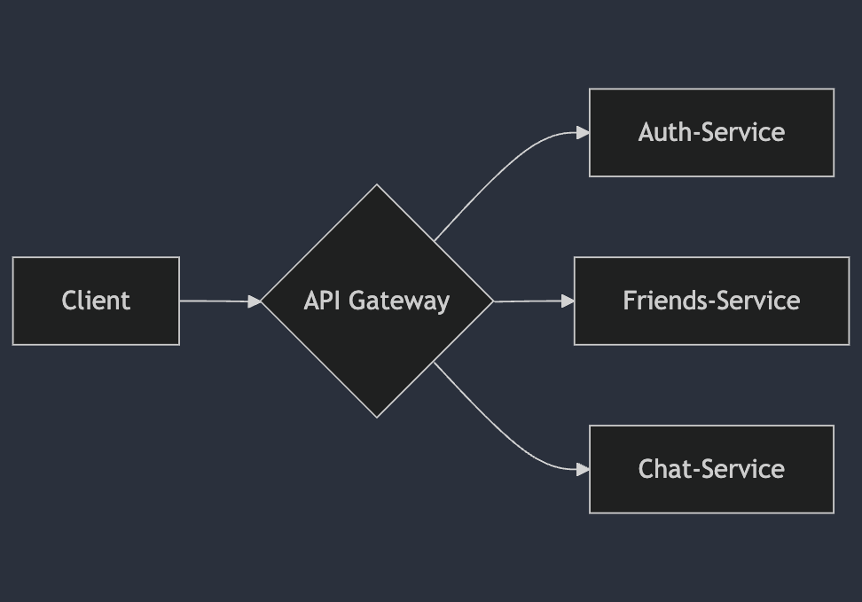
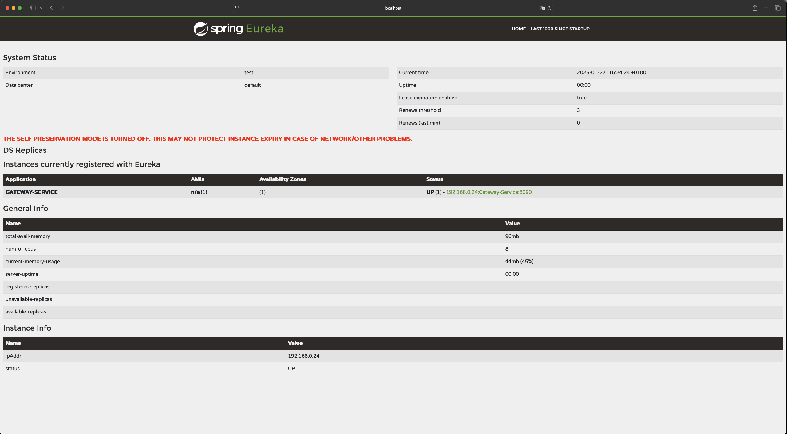

# Eureka Gateway Documentation

## Introduction
Eureka-Gateway routes incoming requests to the appropriate microservices and secures the endpoints.
It has been written by using technologies:
* Java version 21.0.2
* Spring Boot version 3.3.6
* Spring Cloud version: 2023.0.3
* Eureka Client: Spring Cloud Netflix Eureka
* Spring Cloud Gateway: for API Gateway functionality
* Maven: for project dependency management and build automation

### Diagram




## Setup and configuration

* [application.properties](src/main/resources/application.properties)
* [maven config file](pom.xml)


## How it works?
To run project ensure that all dependencies are installed end you have correctly configured Eureka-Service.
Run first the Eureka-Service, then the Eureka-Gateway by entering command:

```shell
mvn spring-boot:run
```

Once the Eureka-Service and Eureka-Gateway is running, you can access the dashboard by navigating to the following URL in your
browser:

http://localhost:8761


The result should look like this:



## Important annotations

For the Gateway-Service to work properly, make sure that the following annotations have been added to the main
application class:

* **@SpringBootApplication:** this is mandatory for Spring Boot,
* **@EnableEurekaClient:** is used to enable Eureka Client functionality in a Spring Boot application
